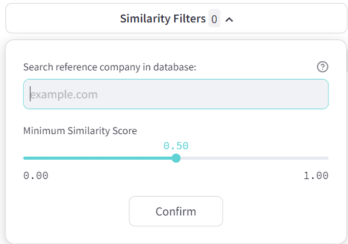
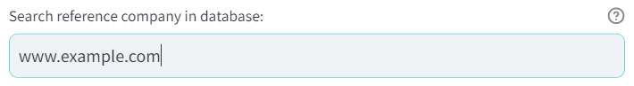
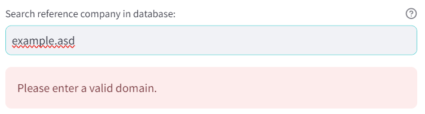
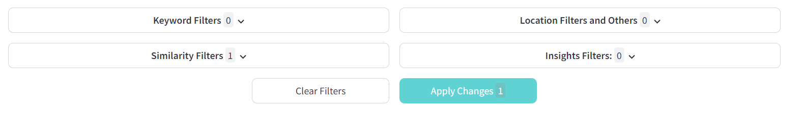

# 👬 Similarity Search

You can access the similarity filter by clicking the `Similarity Filters` button in the [Company List Creator](company-list-creator.md) view. This will open up the options menu where you can select your reference company and adjust the the `Minimum Similarity Score`.

<figure><figcaption>
Similarity search options window.
</figcaption></figure>

## How does the similarity search work?

The reference company you select will be the basis for the similarity search. WebAI will scan the database for other companies with similar website contents. The similarity between two company websites is determined by the overall nature of their texts respectively the content of these texts. Language may play a role, but in general webAI has no problem recognizing the French website of a mechanical engineering company as similar to the German website of another mechanical engineering company.&#x20;

WebAI calculates a similarity score for each company in the database and the reference company you enter. The score will be close to 1.0 for very similar companies and close to 0.0 for very dissimilar companies. The minimum similarity score that must be reached in order to classify another company as “similar enough” can be set using the “Minimum Similarity Score” slider. Only companies that achieve at least the specified score will appear in the results list. A good starting point is 0.5.&#x20;

<mark style="color:yellow;">**`Note:`**</mark><mark style="color:yellow;">` `</mark><mark style="color:yellow;">`WebAI only displays the 100 most similar companies in the results list if at least 100 companies achieve the set similarity score. If fewer companies achieve the minimum value, fewer companies will be displayed. If no companies are found at all, it is recommended to set the threshold value lower.`</mark>

## Using the similarity search

Enter the website address of the company you want to use as a reference for the similarity search. You can enter the website address in the usual formats, such as https://example.com or www.example.com or example.com. Then confirm your entry with the Enter key.&#x20;

<mark style="color:yellow;">`Important: Only websites that are already in our database can be used as a reference.`</mark>

<figure><figcaption>
Reference company entered.
</figcaption></figure>

If the entered reference company is available in our database, you will see a green confirmation text box and your reference company has been set successfully. In order to switch to another reference company, click `Change Similarity Search`.

<figure><figcaption>
Reference company found in database and set successfully.
</figcaption></figure>

In case the entered reference company is not available in our database, you will see a red warning text. Please select a different reference company.&#x20;

<figure><figcaption>
Reference company not found in database.
</figcaption></figure>

In order to update your search results after entering a valid reference company, please click the `Apply Changes` button in the main view.

<figure><figcaption>
Main view with set similarity filter and Apply Changes button.
</figcaption></figure>

<mark style="color:yellow;">`Note: You can combine the similarity search with any of the other available filters like keywords or location filters to further narrow down and refine your search results.`</mark>
