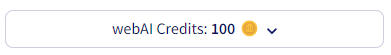
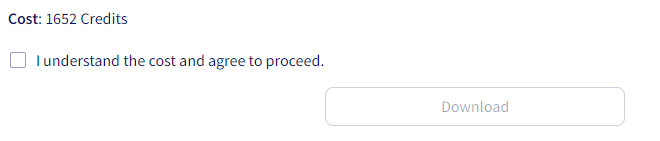
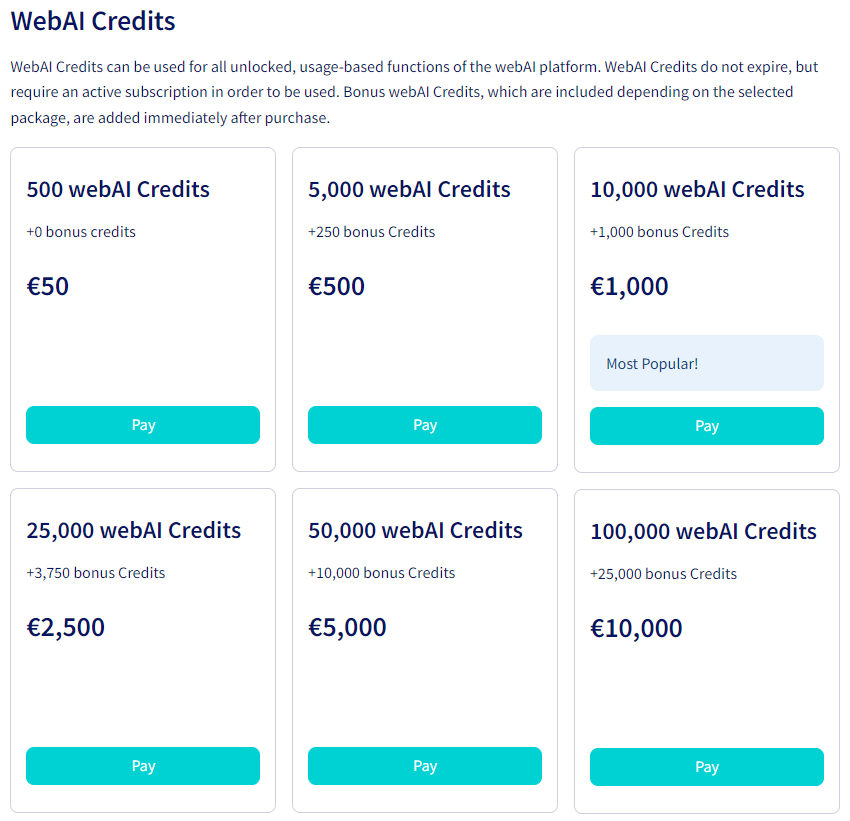

# 🪙 webAI Credits

When you sign up for a subscription, you will be allocated a certain amount of webAI Credits (you can find out the exact number in the [Pricing & plans ](broken-reference)section). Your currently available credits are displayed at all times in the [Credit Indicator](https://docs.istari.ai/platform-overview#credit-indicator) at the top right of the main panel.

<figure><figcaption>
Credit Indicator indicating 100 available webAI Credits.
</figcaption></figure>

## Using webAI Credits

With webAI Credits you can use certain paid functions in the webAI Platform. If you do not have enough credits for a certain function, you will not be able to perform this function and will have to buy additional webAI credits first (see below).

If a function is subject to a charge, this will always be clearly displayed. So you don't have to worry about accidentally using up credits. For larger amounts, you must actively confirm that you are ready to use webAI Credits.

<figure><figcaption>
Exemplary confirmation of webAI Credit usage.
</figcaption></figure>

For very small amounts, you will instead be shown a coin symbol (please note that the appearance of the symbol may vary depending on your device) in the corresponding button indicating that you will use (i.e. consume) the displayed amount of webAI Credits with each click.

<figure><figcaption>
Exemplary "Analysis" button indicating a cost of 1 webAI Credit per click.
</figcaption></figure>

## Buying additional webAI Credits

You can buy additional webAI Credits at any time, which will then be added to your credit balance immediately. To do this, either click on `webAI Credits` in the side panel or on `Buy webAI Credits` in the webAI Credit Indicator menu. Both will take you to the webAI Credits overview, where you can see the available webAI Credit packages.

<figure><figcaption>
Available webAI Credits packages.
</figcaption></figure>

Depending on the package you choose, you will be rewarded a certain number of bonus credits. For example, if you go for the popular "10,000 webAI Credits" package, you will receive 1,000 bonus credits after checkout, giving you a total of 11,000 webAI credits.
